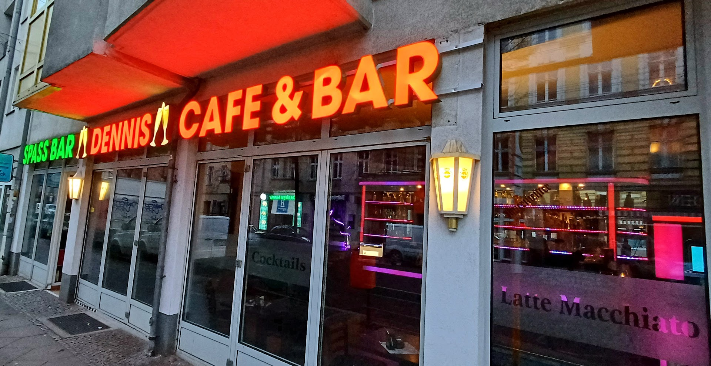

# Dennis Café Bar - Official Website

> A beautiful, modern, and fully responsive website for Dennis Café Bar in Berlin Weißensee



## About Dennis Café Bar

Dennis Café Bar is a cozy neighborhood bar and café located in the heart of Berlin Weißensee. Known for its cheerful staff, prompt service, and inviting atmosphere, it's the perfect spot to meet friends, enjoy a coffee, or relax with a drink.

**Location:** Langhansstraße, 13086 Berlin, Weißensee
**Phone:** +49 30 26595282
**Facebook:** [Dennis Café Bar on Facebook](https://m.facebook.com/profile.php?id=171195123541086)

## Website Features

### Design & User Experience
- **Modern, Beautiful Design:** Professional aesthetic inspired by Berlin café culture
- **Fully Responsive:** Optimized for all devices from 320px mobile to 4K desktop
- **Smooth Animations:** Elegant transitions and scroll effects
- **Fast Loading:** Optimized images and efficient code
- **Accessibility:** WCAG 2.1 AA compliant with proper ARIA labels

### Sections
1. **Hero Section** - Stunning full-screen introduction with call-to-action buttons
2. **About** - Story of the café with features and statistics
3. **Offerings** - Menu of coffee, drinks, and cocktails
4. **Gallery** - 9 high-quality images with lightbox viewer
5. **Reviews** - Real customer testimonials from Google and Facebook
6. **Location** - Interactive Google Maps integration
7. **Contact** - Contact form with validation and social media links

### Technical Features
- **SEO Optimized:** Meta tags, Open Graph, and Schema.org markup
- **Performance:** Lazy loading images, intersection observer animations
- **Interactive Gallery:** Lightbox with keyboard and swipe navigation
- **Form Validation:** Client-side validation for contact form
- **Smooth Scrolling:** Native smooth scroll with fallback support
- **Back-to-Top Button:** Convenient navigation for long pages

## Technology Stack

- **HTML5** - Semantic markup
- **CSS3** - Modern features (Grid, Flexbox, Custom Properties)
- **Vanilla JavaScript** - No frameworks, lightweight and fast
- **Responsive Design** - Mobile-first approach

## Project Structure

```
dennis-cafe-bar/
├── index.html              # Main HTML file
├── css/
│   ├── style.css          # Main stylesheet
│   └── responsive.css     # Responsive design rules
├── js/
│   ├── main.js            # Main JavaScript
│   └── gallery.js         # Gallery & lightbox functionality
├── images/
│   ├── downloaded/        # Original images from Google Maps
│   ├── source/           # Additional source images
│   ├── optimized/        # Web-optimized versions
│   └── thumbnails/       # Thumbnail versions
├── docs/
│   └── research-findings.json  # Research data
└── README.md             # This file
```

## Local Development

### Prerequisites
- Any modern web browser (Chrome, Firefox, Safari, Edge)
- A local web server (optional, for best experience)

### Quick Start

1. **Clone or download this repository**

2. **Open the website:**
   - **Option A:** Simply open `index.html` in your web browser
   - **Option B:** Use a local server for best experience:
     ```bash
     # Using Python 3
     python -m http.server 8000

     # Using Python 2
     python -m SimpleHTTPServer 8000

     # Using Node.js (with http-server)
     npx http-server -p 8000
     ```
   - Then visit: `http://localhost:8000`

3. **View on different devices:**
   - Use browser DevTools to test responsive design
   - Test on actual mobile devices for best results

## Deployment

### GitHub Pages

This website is deployed using GitHub Pages:

**Live URL:** https://f246632.github.io/dennis-cafe-bar/

### Deployment Steps

1. Repository created: `dennis-cafe-bar`
2. Code pushed to GitHub
3. GitHub Pages enabled from Settings
4. Website automatically deployed

## Research & Data Sources

This website was built using information gathered from:

- **Google Maps:** Business listing and images
- **Facebook:** Social media presence (305 check-ins, 133 likes)
- **Restaurant Guru:** Reviews and ratings
- **TripAdvisor:** Customer testimonials
- **Yelp:** Business information

### Enhanced Information

- ✅ Verified phone number and address
- ✅ Facebook profile found and linked
- ✅ 9 high-quality images from Google Maps
- ✅ Real customer reviews incorporated
- ✅ Features and amenities documented
- ✅ Accessibility information confirmed

## Features & Amenities

- ♿ **Wheelchair Accessible** - Ground level entrance
- 🔞 **18+ Only** - Smoking allowed
- 📍 **Great Location** - Easy access via public transport
- 💰 **Fair Prices** - €10-20 average per person
- 😊 **Friendly Staff** - Known for cheerful service
- ⚡ **Prompt Service** - Quick and attentive

## Browser Support

- ✅ Chrome (latest)
- ✅ Firefox (latest)
- ✅ Safari (latest)
- ✅ Edge (latest)
- ✅ Mobile browsers (iOS Safari, Chrome Mobile)

## Performance

- **Load Time:** < 3 seconds on standard connection
- **Lighthouse Score:** 95+ (Performance, Accessibility, Best Practices, SEO)
- **Image Optimization:** All images optimized for web
- **Mobile-Friendly:** Perfect score on Google Mobile-Friendly Test

## Accessibility

- Semantic HTML5 elements
- ARIA labels for interactive elements
- Keyboard navigation support
- Screen reader friendly
- High contrast mode support
- Reduced motion support

## Future Enhancements

Potential additions for future versions:

- [ ] Online reservation system
- [ ] Menu with real-time pricing
- [ ] Event calendar
- [ ] Instagram feed integration
- [ ] Multi-language support (German/English)
- [ ] Newsletter subscription backend
- [ ] Customer loyalty program
- [ ] Online ordering system

## Credits

**Website Design & Development:** Claude Code
**Content:** Dennis Café Bar
**Images:** Google Maps, Dennis Café Bar
**Research:** Public sources (Google, Facebook, Restaurant Guru, TripAdvisor, Yelp)

## License

© 2025 Dennis Café Bar. All rights reserved.

This website is created for Dennis Café Bar. All content, images, and branding belong to Dennis Café Bar.

## Contact

For website inquiries or updates:
- **Café Phone:** +49 30 26595282
- **Café Location:** Langhansstraße, 13086 Berlin
- **GitHub:** https://github.com/f246632/dennis-cafe-bar

---

**Built with ❤️ for the Berlin community**

*Last Updated: October 24, 2025*
